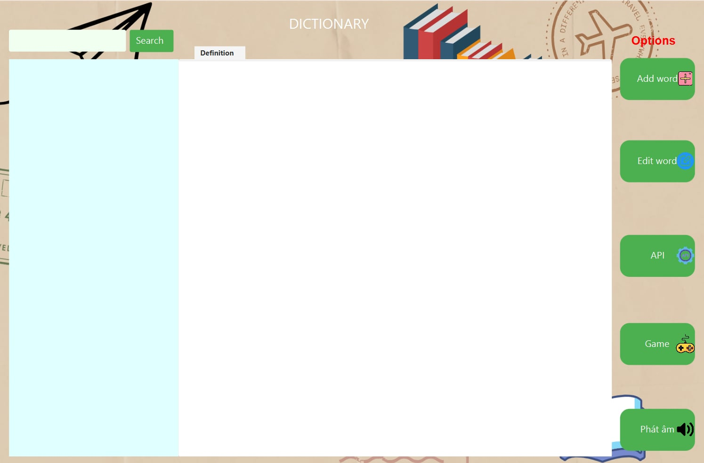

# ENGLISH DICTIONARY APPLICATION

## Thành viên

Group HTL 
- 23020382 Ngô Nguyễn Khải Hưng - K68 AI2
- 23020394 Ngô Đình Linh - K68 AI2
- 23020440 Lường Minh Trí - K68 AI2

## Chức năng
- Từ điển với hơn 7000 từ
- Chức năng thêm, sửa, xóa từ
- Tra từ (Áp dụng Trie)
- Sử dụng API Google translate
- Phát âm tiếng anh (Text to speech)
- Game chọn đáp án đúng (Quiz)

## Áp dụng
- Intellij
- Scene Builder
- JavaFX
- CSS

## Hướng dẫn sử dụng
**Eclipse:**
Run as -> Run Configurations
- Main class: application.DictionaryApplication
- Name: JavaFX

## Xem trước

